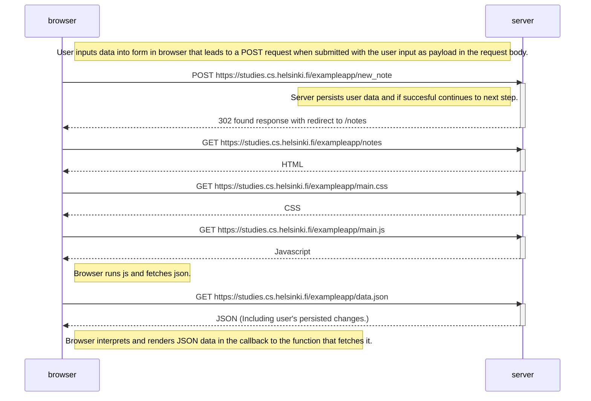

# Sequence of new note.

```mermaid

sequenceDiagram
   participant browser
   participant server

   Note right of browser: User inputs data into form in browser that leads to a POST request when submitted with the user input as payload in the request body.

    browser->>server: POST https://studies.cs.helsinki.fi/exampleapp/new_note
    activate server
    Note left of server: Server persists user data and if succesful continues to next step.

    server-->>browser: 302 found response with redirect to /notes
    deactivate server

    browser->>server: GET https://studies.cs.helsinki.fi/exampleapp/notes
    activate server
    server-->>browser: HTML
    deactivate server

    browser->>server: GET https://studies.cs.helsinki.fi/exampleapp/main.css
    activate server
    server-->>browser: CSS
    deactivate server

    browser->>server: GET https://studies.cs.helsinki.fi/exampleapp/main.js
    activate server
    server-->>browser: Javascript
    deactivate server

    Note right of browser: Browser runs js and fetches json.

    browser->>server: GET https://studies.cs.helsinki.fi/exampleapp/data.json
    activate server
    server-->>browser: JSON (Including user's persisted changes.)
    deactivate server

    Note right of browser: Browser interprets and renders JSON data in the callback to the function that fetches it.
```