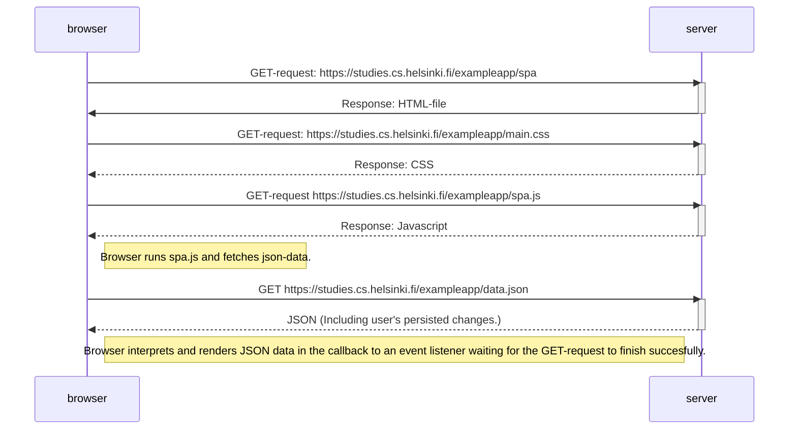

# Sequence of SPA.

```mermaid

sequenceDiagram
   participant browser
   participant server

    browser->>server: GET-request: https://studies.cs.helsinki.fi/exampleapp/spa

    activate server
    server->>browser: Response: HTML-file
    deactivate server

    browser->>server: GET-request: https://studies.cs.helsinki.fi/exampleapp/main.css
    activate server
    server-->>browser: Response: CSS
    deactivate server

    browser->>server: GET-request https://studies.cs.helsinki.fi/exampleapp/spa.js
    activate server
    server-->>browser: Response: Javascript
    deactivate server

    Note right of browser: Browser runs spa.js and fetches json-data.

    browser->>server: GET https://studies.cs.helsinki.fi/exampleapp/data.json
    activate server
    server-->>browser: JSON (Including user's persisted changes.)
    deactivate server

    Note right of browser: Browser interprets and renders JSON data in the callback to an event listener waiting for the GET-request to finish succesfully.
```