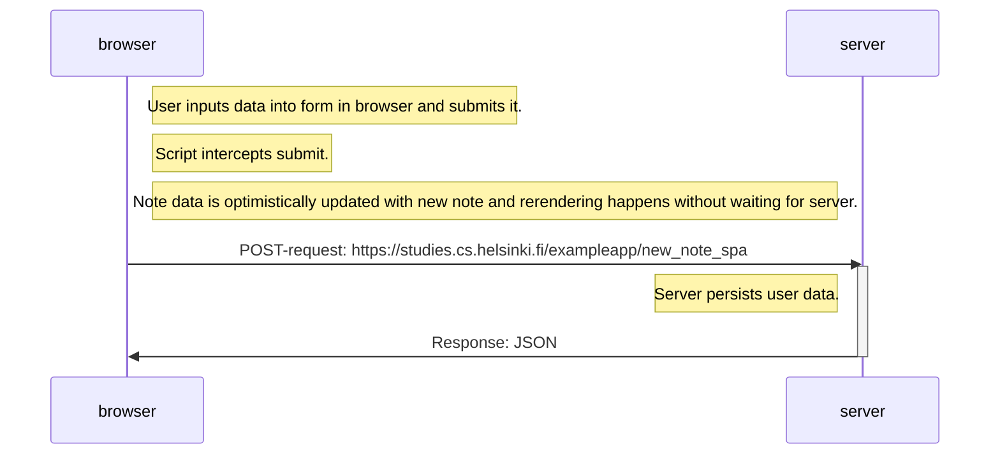

# Sequence of new note.

```mermaid

sequenceDiagram
   participant browser
   participant server

   Note right of browser: User inputs data into form in browser and submits it.

   Note right of browser: Script intercepts submit.

   Note right of browser: Note data is optimistically updated with new note and rerendering happens without waiting for server.

    browser->>server: POST-request: https://studies.cs.helsinki.fi/exampleapp/new_note_spa
    activate server
    Note left of server: Server persists user data.
    server->>browser: Response: JSON
    deactivate server
```